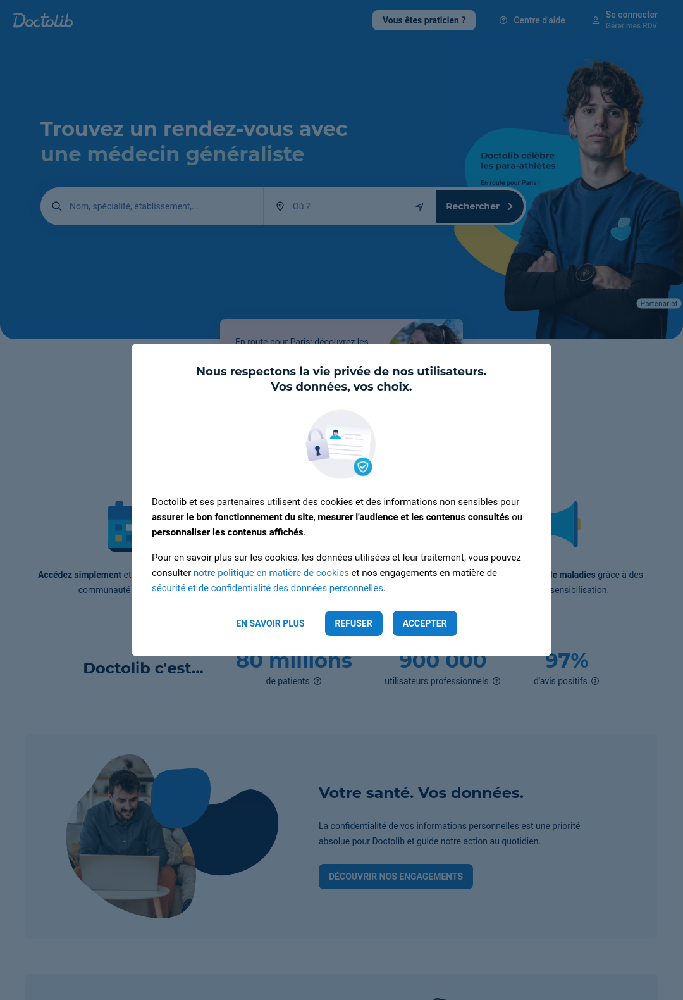
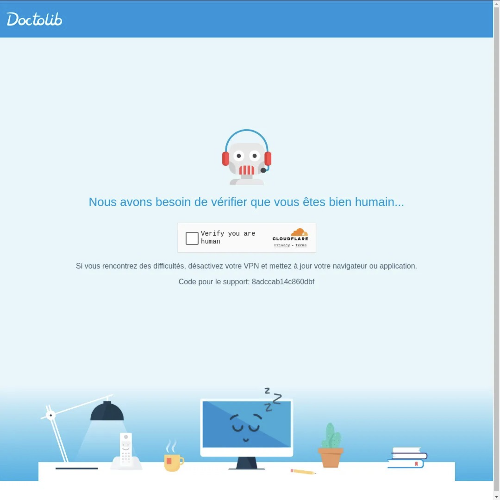

# Medical appointment booking

## 🌊 Medical appointment booking with LaVague

<a target="_blank" href="https://colab.research.google.com/github/lavague-ai/LaVague/blob/main/docs/docs/examples/notebooks/doctolib_medical_appointment_booking.ipynb">
</a>

This notebook shows how one can use LaVague to create an AI Web Agent that can navigate the web to find out if a doctor is available to book an appointment!

We will automate booking on [Doctolib](https://www.doctolib.fr/), a French leader in medical appointment as an example, but this should work on other websites.

If not, do not hesitate to reach out to us on [Discord](https://discord.com/invite/SDxn9KpqX9) to share your issues.

<video src="https://github.com/lavague-ai/lavague_static_resources/raw/main/LaVague_Doctolib_demo.mp4" width="1024" height="768" controls></video>

## Overview

We will create the agent and serve it through a [Gradio](https://huggingface.co/papers) interface.

We will use the following solutions to build this AI Web Agent:

- [Claude Sonnet 3.5](https://docs.anthropic.com/en/docs/quickstart) for the [World Model](https://docs.lavague.ai/en/latest/docs/get-started/customization/) to do web planning. You will need to provide an `ANTHROPIC_API_KEY` after getting it. You can look at how to use other models
- [Llama 3.1 70b](https://huggingface.co/meta-llama/Meta-Llama-3.1-70B-Instruct) for the [Action Engine](https://docs.lavague.ai/en/latest/docs/learn/action-engine/) to do action generation to pilot the browser. Here we will use [Fireworks](https://docs.fireworks.ai/getting-started/quickstart) API to consume a managed Llama 3.1 70b. You will therefore need to provide a `FIREWORKS_API_KEY`.
- [OpenAI text-embedding-3-small](https://platform.openai.com/docs/guides/embeddings/embedding-models) to do semantic search on the DOM to find the right element to interact with. This will require an `OPENAI_API_KEY` that you can get following their [quickstart](https://platform.openai.com/docs/quickstart).

If you want to know more about LaVague, you can have a look at our [architecture](https://docs.lavague.ai/en/latest/docs/learn/architecture/), or our [webinars](https://www.youtube.com/watch?v=vBV6s9-_cDs&list=PLzPkw6m0RrnW2SadaswvCAHmyWABOSp8X).

## Installation

We start by downloading LaVague and the other integrations:

```bash
pip install lavague
pip install llama-index-multi-modal-llms-anthropic
pip install llama-index-llms-fireworks
```

!!! warning "API KEYS"
    To run this code example, you will need to have the following API keys set in your current environment:
        
    - OPENAI_API_KEY
    - ANTHROPIC_API_KEY
    - FIREWORKS_API_KEY

    To learn how to change the models used in this code to leverage different AI providers, see our [customization guide](../get-started/customization.md)

    For instructions on how to set environment variable in your environment, see our [FAQ guide](../get-started/FAQs.md#how-can-i-set-environment-variables)

## Demo

### Agent preparation

We start here by pulling extra knowledge about Doctolib to ensure the `WorldModel` will provide the right reasoning steps.

You can learn more about building Agents with LaVague in our [webinar](https://www.youtube.com/watch?v=bNE4s8h3CIc).

```bash
!wget https://raw.githubusercontent.com/lavague-ai/LaVague/main/examples/knowledge/doctolib_knowledge.txt
```

We prepare our different integrations then create the Agent:

```python
from lavague.drivers.selenium import SeleniumDriver
from lavague.core import ActionEngine, WorldModel
from lavague.core.agents import WebAgent

from llama_index.multi_modal_llms.anthropic import AnthropicMultiModal
from llama_index.llms.fireworks import Fireworks
from llama_index.embeddings.openai import OpenAIEmbedding

# Loading the models
mm_lmm = AnthropicMultiModal(model="claude-3-5-sonnet-20240620", max_tokens=512)
llm = Fireworks(model="accounts/fireworks/models/llama-v3p1-70b-instruct", max_tokens=1024)
embedding = OpenAIEmbedding(model="text-embedding-3-small")

# Preparing the Agent
driver = SeleniumDriver(headless=True, no_load_strategy=True)
action_engine = ActionEngine(driver,
                             llm=llm,
                             embedding=embedding,
                             )
world_model = WorldModel(mm_llm=mm_lmm)
world_model.add_knowledge("doctolib_knowledge.txt")

# Create Web Agent
agent = WebAgent(world_model, action_engine, n_steps=15)

# Set URL
agent.get("https://www.doctolib.fr/")
```

### Checking the driver is not blocked

It can happen that the driver is blocked.

To check if it is the case, we need to see what is the state of the current page.

Let's display the current screenshot.

```python
import time
# We wait to make sure the page is fully loaded
time.sleep(5)

driver.driver.save_screenshot("screenshot.png")
from IPython.display import Image
Image("screenshot.png")
```

If you see this, you are good to proceed to running the Agent.



If you see the following screenshot, we will show you ways to avoid unblock the situation:



#### Unblocking with another Colab Instance

If you are blocked and on Google Colab, just delete the instance and get a new one and see if this one is not blocked.

#### Unblocking with Browser Base

If ever you encounter some error showing your browser is being blocked, try using Browser Base with the following code from their [Quick tour](https://docs.browserbase.com/quickstart/selenium) to setup a managed Selenium Driver:

```python
from selenium import webdriver
from selenium.webdriver.remote.remote_connection import RemoteConnection
from selenium.webdriver.common.desired_capabilities import DesiredCapabilities
import requests
import os

def create_session():
    url = 'https://www.browserbase.com/v1/sessions'
    headers = {'Content-Type': 'application/json', 'x-bb-api-key': os.environ["BROWSERBASE_API_KEY"]}
    response = requests.post(url, json={ "projectId": os.environ["BROWSERBASE_PROJECT_ID"] }, headers=headers)
    return response.json()['id']

class CustomRemoteConnection(RemoteConnection):
    _session_id = None

    def __init__(self, remote_server_addr: str, session_id: str):
        super().__init__(remote_server_addr)
        self._session_id = session_id

    def get_remote_connection_headers(self, parsed_url, keep_alive=False):
        headers = super().get_remote_connection_headers(parsed_url, keep_alive)
        headers.update({'x-bb-api-key': os.environ["BROWSERBASE_API_KEY"]})
        headers.update({'session-id': self._session_id})
        return headers

# Create a new session
session_id = create_session()

custom_conn = CustomRemoteConnection('http://connect.browserbase.com/webdriver', session_id)
options = webdriver.ChromeOptions()
options.debugger_address = "localhost:9223"

driver.driver = webdriver.Remote(custom_conn, options=options)
```

#### Unblocking by running with `headless=False`

Another option is to simply run a driver in non-headless mode with:

```py
driver = SeleniumDriver(headless=True, no_load_strategy=True)
```

Note that this will not work on Colab, you will have to do it on your own machine.

#### Running the Agent

Now we can run the Agent to try booking an appointment for us! We provide the objective below and run it:

```python
objective = """Accept cookies if they are shown.
Find dermatologists in Paris.
When filling input fields, wait for the results to update before clicking on the most relevant result.
When on the search page, scan the results to find the first dermatologist available in August 2024.
If you find a relevant dermatologist, try to book an appointment in person as a new patient. If not available you can stop here.
Don't use the Python Engine."""

agent.demo(objective=objective)
```
